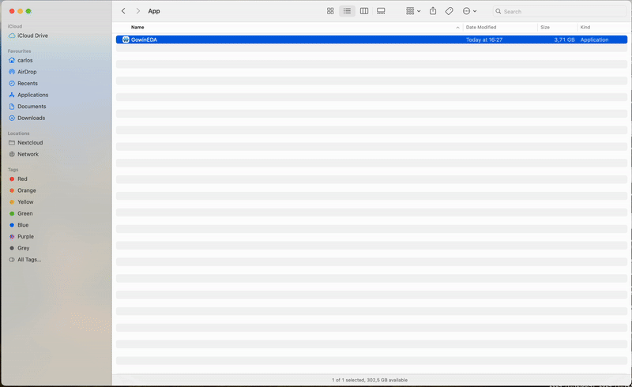

# Gowin EDA macOS fixer



## Description

Gowin has released a macOS version of their Gowin EDA package (Education version). Unfortunately it is badly linked (contains links to dynamic libraries outside the package) and is not provided in a macOS App format.

This scripts remedies both issues, automatically unpacking the `.tar.gz` file provided by Gowin, fixing the dynamic library links in the provided binaries using `install_name_tool`, and packing everything inside a nice to use App bundle.

## Usage

1. Download the mac release of the Gowin EDA from the [official website](https://www.gowinsemi.com/en/support/download_eda/). [Direct link to package](https://cdn.gowinsemi.com.cn/Gowin_V1.9.10.03_Education_macOS.tar.gz).
2. Download the script file from this repo.
3. Run the script with one parameter pointing to the downloaded archive (e.g. `Gowin_V1.9.10.03_Education_macOS.tar`):

    ```sh
    gowin_eda_mac_fixer.sh Gowin_V1.9.10.03_Education_macOS.tar.gz
    ```
4. You should now have an app named *GowinEDA* in the current directory.
